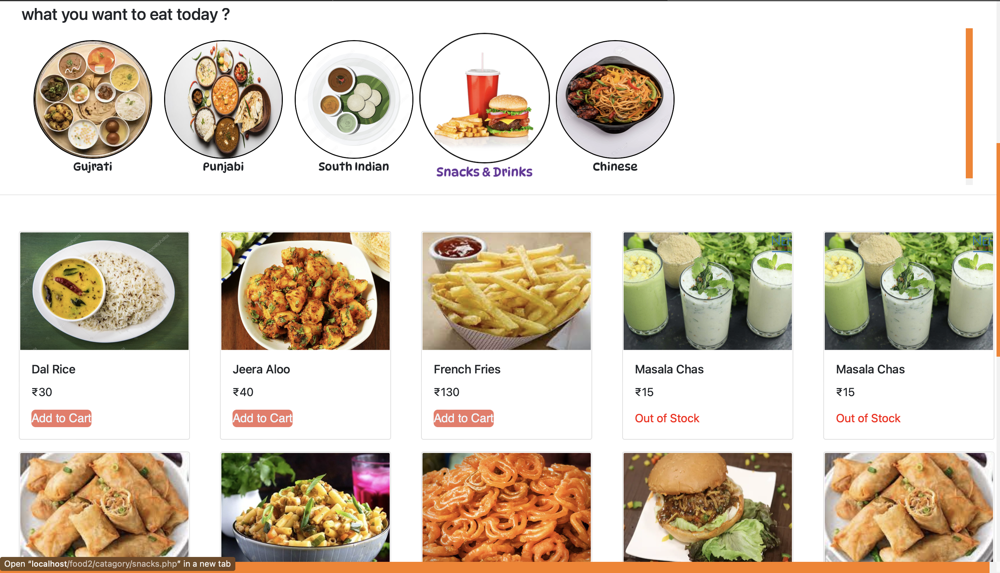

# token management for canteen
###
<h2 align="left">Tech Used</h2>

in this project we used php,mysql,xampp,html,css,bootstrap

we implemented basic crud operation inserting and deleting new items in dynamically with php

authenticating logged in user with session

made cart with session

for user authentication we used mysql but with encryption for user saftey.

used captcha for preveting bot's.

###

<h2 align="left">Some Photos Of Our Projext</h2>

###

  
  
  
  
  
  
  
  
  
  
  
  
  
  
  
  

