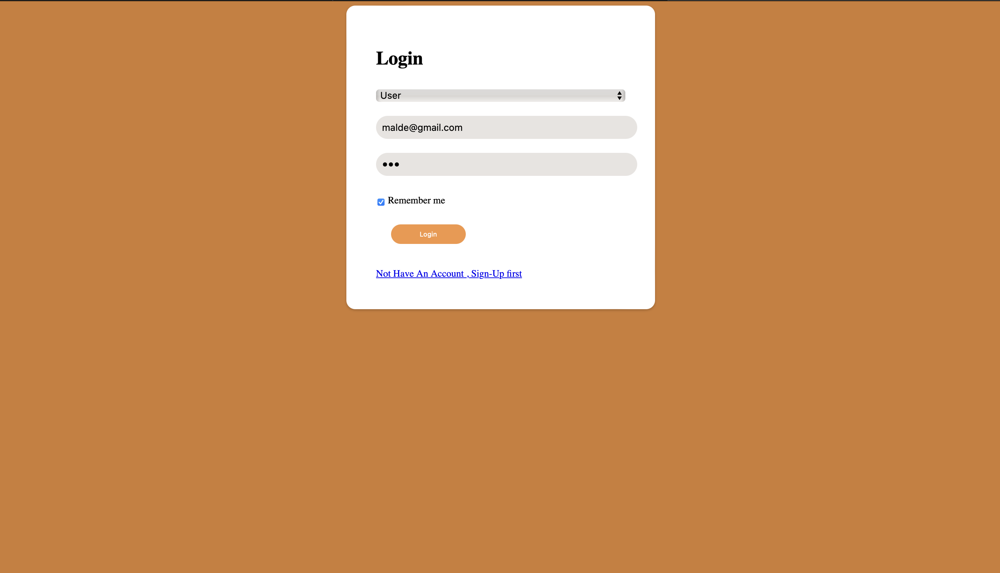
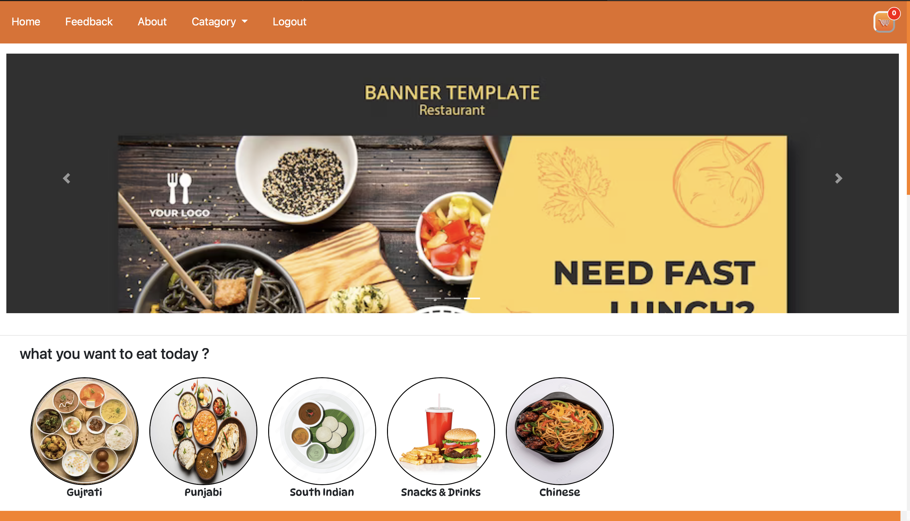
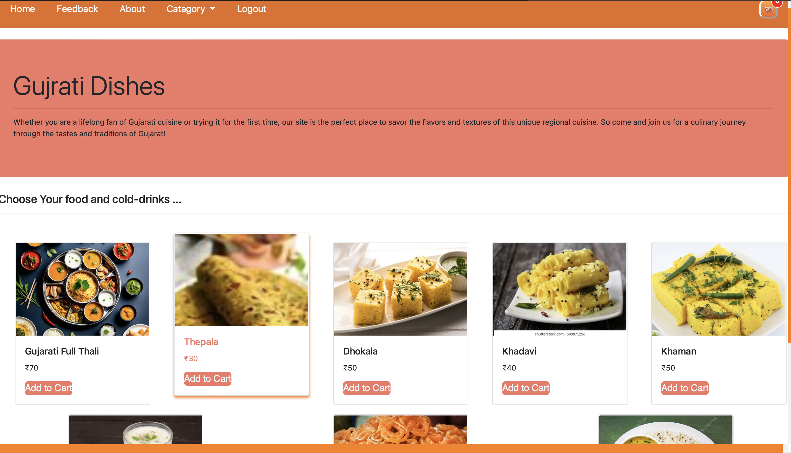
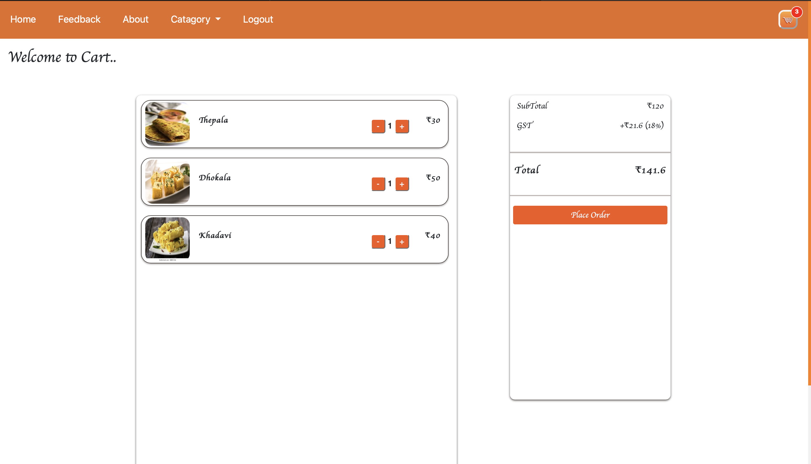
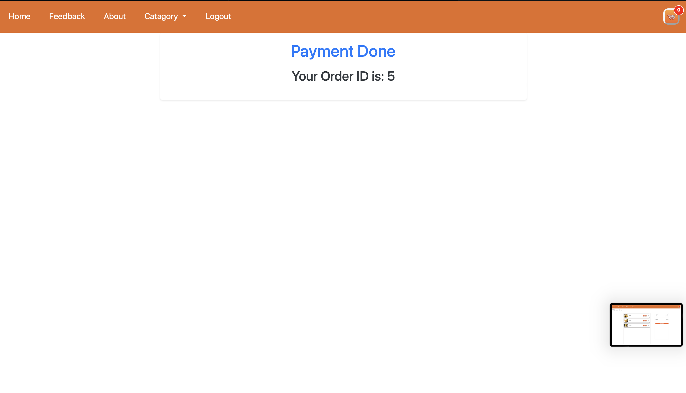
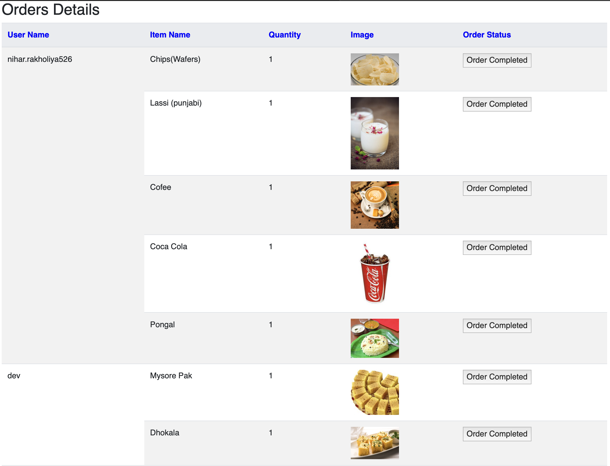
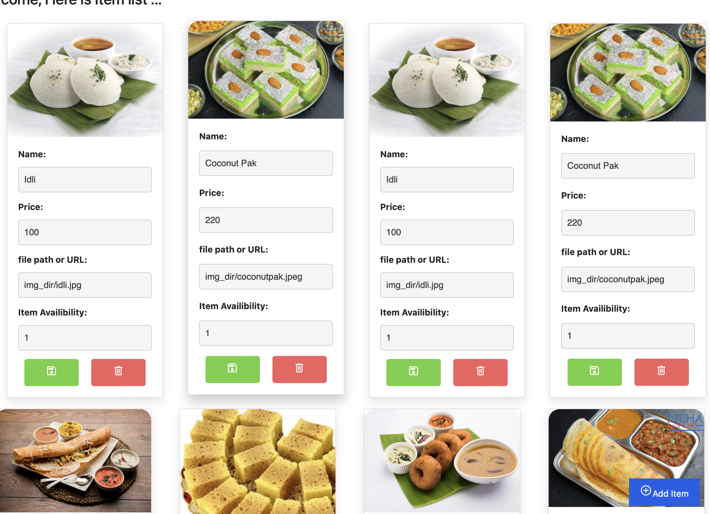

# token management for canteen
-in this project we used php,mysql,xampp,html,css,bootstrap
#
-we implemented basic crud operation inserting and deleting new items in dynamically with php
#
-for user authentication we used mysql but with encryption for user saftey.
#
-used captcha for preveting bot's.

###

<h2 align="left">Some Photos Of Our Projext</h2>

###

  
  
  
  
  
  
  
  
  
  
  
  
  
  
  
  

